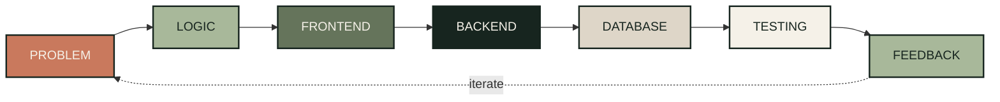

::: {align="center"}
``{=html}

`<br/>`{=html}`<br/>`{=html}

``{=html}

`<br/>`{=html}`<br/>`{=html}

`<a href="https://readme-typing-svg.demolab.com/">`{=html}
``{=html}
`</a>`{=html}

`<br/>`{=html}`<br/>`{=html}

`<a href="https://reva-cahyadi.vercel.app">`{=html}
``{=html}
`</a>`{=html} `<a href="https://www.linkedin.com/in/USERNAME">`{=html}
``{=html}
`</a>`{=html} `<a href="https://www.instagram.com/USERNAME">`{=html}
``{=html}
`</a>`{=html}
:::

------------------------------------------------------------------------

## `01` ABOUT ME

**Manajemen Informatika --- Politeknik LP3I Jakarta.**

Saya mahasiswa Manajemen Informatika yang tertarik pada **Full-Stack
Development** dan pengembangan sistem berbasis web.

Saya tidak hanya tertarik membuat tampilan website, tetapi juga memahami
bagaimana sebuah sistem bekerja dari belakang layar --- mulai dari
**user flow, logic, frontend, backend, hingga database**.

Saya suka mencoba hal baru, membangun project, melakukan eksperimen, dan
belajar melalui proses.

> **Bukan hanya membuat website yang berjalan,\
> tapi memahami mengapa sistem itu harus bekerja seperti itu.**

------------------------------------------------------------------------

## `02` HOW I BUILD



Setiap project saya mulai dari memahami masalah terlebih dahulu.

``` text
Problem
   ↓
User Flow
   ↓
System Logic
   ↓
Frontend
   ↓
Backend
   ↓
Database
   ↓
Testing
   ↓
Feedback
   ↺
```

Saya mencoba memahami:

-   Apa masalah yang ingin diselesaikan?
-   Siapa yang akan menggunakan sistem?
-   Bagaimana alur pengguna?
-   Bagaimana logic sistem bekerja?
-   Bagaimana data disimpan dan diproses?
-   Bagaimana sistem diuji dan dikembangkan?

> **Better Process = Better Product**

------------------------------------------------------------------------

## `03` THINGS I'VE BUILT

  --------------------------------------------------------------------------
           \#           PROJECT          WHAT IT IS        STACK
  --------------------- ---------------- ----------------- -----------------
          `01`          **Reghazmi       E-commerce        `Next.js`
                        Embroidery**     website untuk     `Node.js`
                                         produk bordir     `Supabase`
                                         dengan konsep     
                                         storefront dan    
                                         admin management. 

          `02`          **RELASKA        E-commerce        `Laravel` `PHP`
                        Komputer**       akademik untuk    `MySQL`
                                         komponen komputer 
                                         dengan fitur      
                                         utama PC Builder. 

          `03`          **CI4 News**     Aplikasi berita   `CodeIgniter 4`
                                         berbasis web      `PHP` `MySQL`
                                         dengan            
                                         authentication    
                                         dan database.     

          `04`          **Eco Grid**     Game edukasi yang `Unity` `C#`
                                         dikembangkan      
                                         untuk kompetisi   
                                         KMIPN VIII 2026.  

          `05`          **Academic Web   Berbagai project  `PHP`
                        Systems**        akademik dengan   `CodeIgniter`
                                         CRUD,             `MySQL`
                                         authentication,   
                                         database          
                                         integration, dan  
                                         system workflow.  
  --------------------------------------------------------------------------

------------------------------------------------------------------------

## `04` TECH STACK

### Frontend

``{=html}
``{=html}
``{=html}
``{=html}
``{=html}
``{=html}

### Backend

``{=html}
``{=html}
``{=html}
``{=html}
``{=html}

### Database & Tools

``{=html}
``{=html}
``{=html}
``{=html}
``{=html}

------------------------------------------------------------------------

## `05` CURRENTLY LEARNING

### Focus

-   Full-Stack Development
-   Backend Architecture
-   Database Design
-   API Integration
-   System Thinking
-   Product & Interface Design

### Currently Exploring

`Node.js` `Express.js` `PostgreSQL` `Supabase` `Next.js`

> **Learning by building, experimenting, and shipping.**

------------------------------------------------------------------------

## `06` CURRENT DIRECTION

Saat ini saya fokus berkembang sebagai **Full-Stack Developer**.

Bukan hanya mempelajari lebih banyak framework, tetapi memahami
bagaimana setiap bagian dalam sebuah sistem saling terhubung.

``` text
USER
  ↓
PROBLEM
  ↓
FLOW
  ↓
LOGIC
  ↓
FRONTEND
  ↓
BACKEND
  ↓
DATABASE
  ↓
WORKING SYSTEM
```

Goal saya:

**Take an idea → understand the problem → design the flow → build the
system → improve it.**

------------------------------------------------------------------------

## `07` BEYOND CODE

Saya juga tertarik dengan:

       Interest
  ---- ------------------
   🌱  Product Design
   🔐  Cybersecurity
   📷  Photography
   ⚽  Football
   🎮  Gaming
   🚀  New Technologies

Menurut saya, development bukan hanya tentang kemampuan teknis.

Rasa ingin tahu, kemampuan memahami masalah, dan kemauan untuk terus
belajar juga merupakan bagian dari proses menjadi developer.

------------------------------------------------------------------------

## `08` PERSONAL PHILOSOPHY

::: {align="center"}
### **I don't want to just write code.**

`<br/>`{=html}

**I want to understand the problem,**\
**design the flow,**\
**build the system,**\
**and keep improving it.**

`<br/>`{=html}

`— Reva`
:::

------------------------------------------------------------------------

::: {align="center"}
``{=html}

`<br/>`{=html}`<br/>`{=html}

**Keep building. · Keep learning. · Keep growing.**

`<br/>`{=html}

`Muhamad Reva Cahyadi · Full-Stack Developer in Progress`
:::
